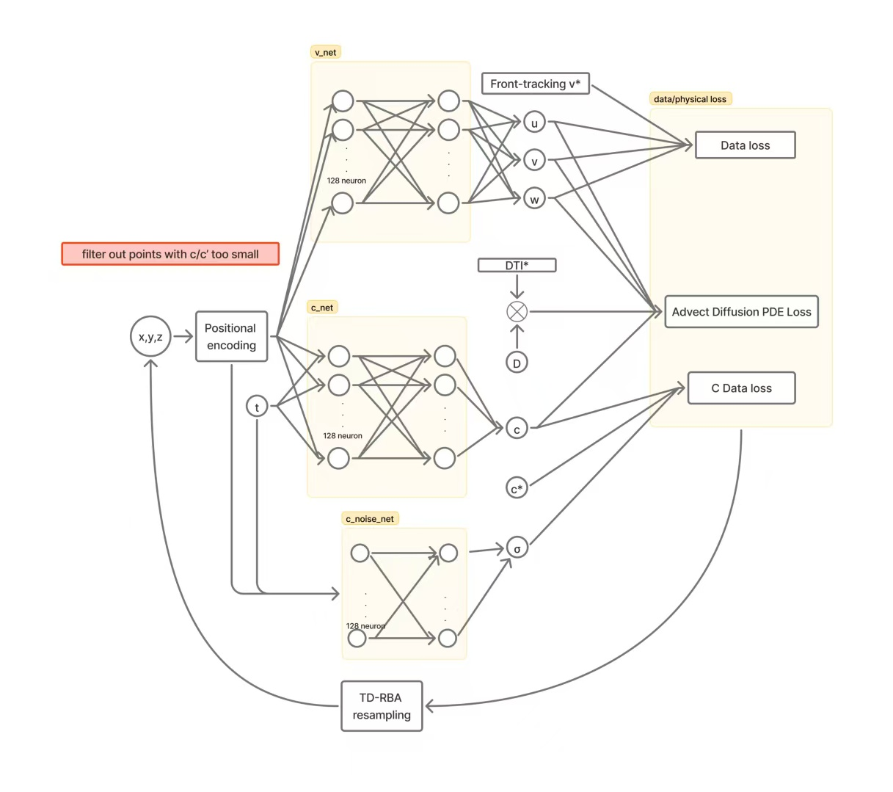
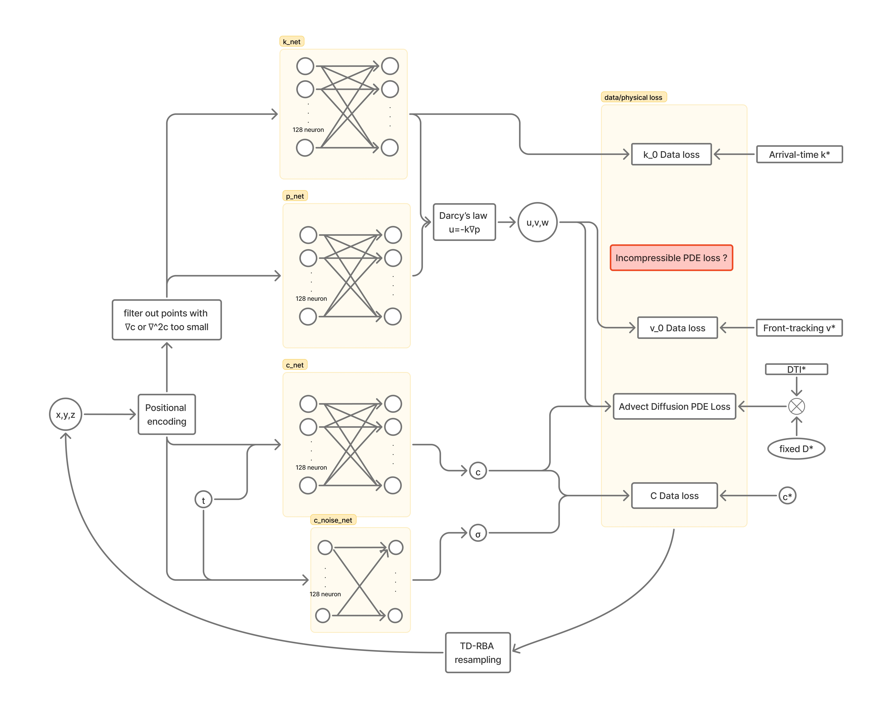

# MRI_PINN
notebooks about PINN applying on DCE-MRI data ,to do fluid dynamic analysis on steady CSF flow of mice.


### Darcy_PINN or AD_PINN

First there is a simple [advect_diffuse_2d.ipynb](advect_diffuse_2d.ipynb) demo that use PINN to learn to predict the velocity and diffusivity coefficient of a simple shape adhering advect-diffuse equation. Then we explore that to 3D net.  

Model structure of advect_diffuse_3d:



Model structure of darcy_3d:



1. **Run in Jupyter lab:** Recommand using vscode, run and probe freely in [advect_diffuse_3d.ipynb](advect_diffuse_3d.ipynb) and [darcy_3d.ipynb](darcy_3d.ipynb) .

2.  **Run from Terminal:** Open a terminal or command prompt, navigate to current directory, and run the script by providing the path to your configuration file.

    *   **To run the Darcy-Coupled model:**
        ```bash
        python driver.py configs/dcpinn_full_runtest.yaml
        ```

    *   **To run the Advection-Diffusion model:**
        ```bash
        python driver.py configs/adpinn_full_runtest.yaml
        ```
